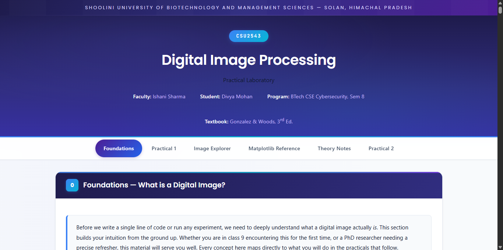
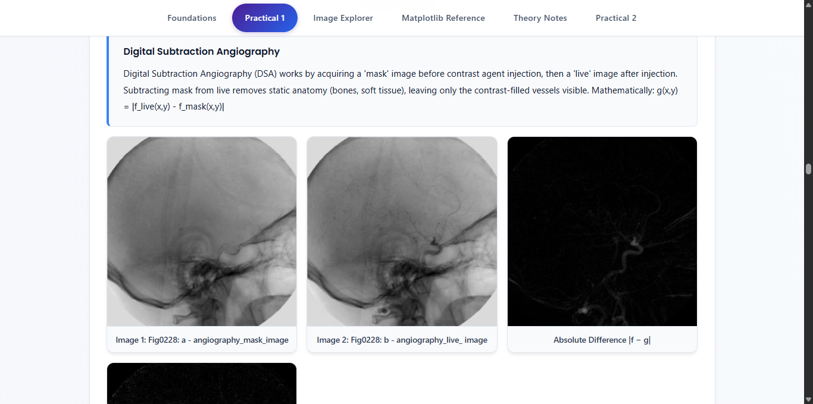
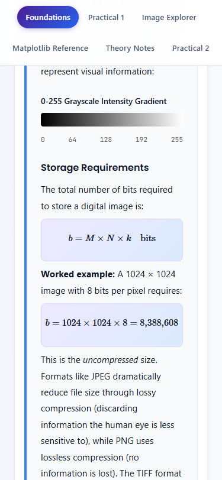

# Digital Image Processing Lab

Interactive web lab for **CSU2543 — Digital Image Processing** at Shoolini University.

**Live:** [dip.dmj.one](https://dip.dmj.one)



## What It Does

A hands-on companion to Gonzalez & Woods' *Digital Image Processing (3e)* Chapters 2 and 3. Load real images, run operations, and see results instantly — no local Python setup needed.

**Practicals:**
- **P1** — Loading and displaying images, histograms (G&W Ch 2)
- **P2** — Sampling rate vs. spatial resolution; aliasing (G&W Ch 2)
- **P3** — Negation, subtraction, inversion; medical-imaging applications (G&W Ch 2–3)
- **P4** — Gamma correction and power-law transformations (G&W Ch 3)
- **P5** — Histogram equalization (G&W Ch 3)
- **P6** — Histogram matching and specification (G&W Ch 3)
- **P7** — 2D correlation and convolution (G&W Ch 3)
- **P8** — Spatial filtering: box, median, Laplacian, Sobel (G&W Ch 3)

Each practical ships in three forms: a **Jupyter notebook** (`Practical_N.ipynb`, runs in Colab), a **Flask server** version with on-demand dataset download, and a **fully static** version (Cloudflare Pages / Vercel) that runs all image processing in the browser via the Canvas API.



## Tech Stack

| Layer | Tech |
|-------|------|
| Backend | Flask, Gunicorn (gthread), OpenCV, Matplotlib, NumPy |
| Frontend | Vanilla JS, CSS custom properties, MathJax |
| Infra | GCP e2-medium, Nginx (reverse proxy + microcache), Cloudflare |

**Concurrency:** 2 workers x 8 threads = 16 simultaneous requests. Nginx microcaches expensive matplotlib endpoints. Load tested at 200 concurrent users with zero failures.

## Quick Start

```bash
# Clone
git clone https://github.com/divyamohan1993/dip-practical.git
cd dip-practical

# Install
python3 -m venv venv && source venv/bin/activate
pip install -r requirements.txt

# Run
python run.py
# Open http://localhost:5000
```

## Deploy to Production

```bash
# One-command deploy on a fresh Ubuntu 24.04 VM
chmod +x autoconfig.sh && sudo ./autoconfig.sh
```

This installs Python, Nginx, sets up systemd, configures the reverse proxy, and starts the app on port 80. See [deploy/nginx-site.conf](deploy/nginx-site.conf) for the Nginx config.

## Project Structure

```
app/
  main.py              # Flask routes (13 endpoints)
  image_processor.py   # OpenCV/Matplotlib processing (13 functions)
  templates/index.html # Single-page app
  static/css/style.css # 2200+ lines of component styles
  static/js/app.js     # Interactive features, zero innerHTML
deploy/
  nginx-site.conf      # Production Nginx config with microcaching
DIP3E_CH02_Original_Images/
  DIP3E_Original_Images_CH02/  # Gonzalez & Woods Ch.2 images (.tif)
```

## API Endpoints

| Method | Path | Description |
|--------|------|-------------|
| GET | `/api/images` | List all available images with metadata |
| GET | `/api/image/<filename>` | Get image as base64 PNG |
| POST | `/api/spatial-difference` | Compute |img1 - img2| with stats |
| POST | `/api/histogram` | Generate histogram plot |
| POST | `/api/comparison-plot` | Full side-by-side comparison |
| GET | `/api/matplotlib-demos` | Live matplotlib demo plots |
| GET | `/api/matplotlib-reference` | Command reference data |
| POST | `/api/pixel-view` | Raw pixel values for a region |
| POST | `/api/step-by-step` | 6-step annotated pipeline |
| POST | `/api/surface-plot` | 3D surface visualization |
| POST | `/api/pixel-arithmetic` | uint8 arithmetic demo |
| POST | `/api/bit-depth` | 8/4/2/1-bit comparison |
| GET | `/health` | Health check |

## Mobile Responsive



## License

MIT

---

**Course:** CSU2543 | **Faculty:** Ishani Sharma | **Student:** Divya Mohan | BTech CSE Cybersecurity, Sem 8
